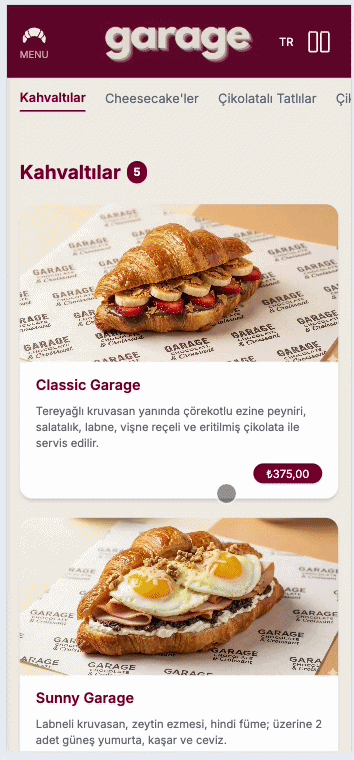

# 🚗 Garage Choc

Modern ve mobil uyumlu bir QR Menü servis arayüzü demo projesidir.



## ✨ Özellikler

- 📂 Kategorilere ayrılmış içerik yapısı
- 📱 Tam mobil uyumlu (responsive) tasarım
- 🧭 Kullanıcı dostu arayüz
- 📌 Sidebar içerisinde iletişim bilgileri (telefon, adres vb.)
- 🎨 Temiz ve sade tasarım anlayışı

Bu proje, restorant/kafe/tatlıcı tarzı işletmeler için hızlı, modern ve kullanıcı deneyimi odaklı bir arayüz örneği sunar.

## 🚀 Hızlı Başlangıç

- **Lokal Geliştirme**: [ENVIRONMENT_SETUP.md](ENVIRONMENT_SETUP.md) rehberini takip edin
- **Vercel Dağıtımı**: [VERCEL_SETUP_GUIDE.md](VERCEL_SETUP_GUIDE.md) rehberini takip edin
- **Environment Şablonu**: [.env.local.example](.env.local.example) dosyasını kopyalayın

## Google Drive Content Sync

Menu verisi artik Google Drive uzerinden cekilebilir. Bu sayede teknik olmayan kullanicilar sadece Google Drive uzerindeki JSON dosyasini ve gorselleri guncelleyerek icerigi yayina alabilir.

### Environment Variables

Proje aşağıdaki ortam değişkenlerini gerektirir:

| Variable                | Açıklama                                | Örnek                                                      |
| ----------------------- | --------------------------------------- | ---------------------------------------------------------- |
| `GOOGLE_DRIVE_MENU_URL` | Menü JSON dosyasının Google Drive linki | `https://drive.google.com/file/d/FILE_ID/view?usp=sharing` |
| `ADMIN_USER`            | Admin paneli kullanıcı adı              | `admin`                                                    |
| `ADMIN_PASS`            | Admin paneli şifre                      | `SuperSecure123!@#`                                        |

**Lokal Setup İçin**: `.env.local` dosyası oluşturun
**Vercel Setup İçin**: Dashboard → Settings → Environment Variables

Detaylı rehber için [ENVIRONMENT_SETUP.md](ENVIRONMENT_SETUP.md) bölümüne bakın.

### API Endpoints

- `GET /api/menu`: Google Drive uzerindeki menu JSON dosyasini ceker ve 60 saniye CDN cache ile doner.
- `GET /api/image?id=FILE_ID`: Google Drive gorselini indirir, `sharp` ile WebP'e cevirir ve 1 yil cache ile doner.
- `POST /api/publish`: Basic Auth korumali publish endpoint'i. `menu` ve `images` cache tag'lerini manuel olarak invalidate eder.

### Publish System

- `/admin`: Basic Auth korumali yonetim sayfasi
- `middleware.ts`: `/admin` ve `/api/publish` path'lerini `ADMIN_USER` ve `ADMIN_PASS` ile korur
- Publish islemi istemci tarafinda secret tutmaz; tarayicinin Basic Auth oturumu ayni origin isteklerinde kullanilir

### Menu JSON - Resim Yapılandırması

**Resimler Google Drive'da tutulur ve otomatik WebP'ye dönüştürülür.**

Her ürün için `imageId` alanını kullanın:

```json
{
  "id": 101,
  "categoryId": 1,
  "imageId": "1A2B3C4D5E6F7G8H9I0J",
  "name": { "tr": "Ürün Adı", "en": "Product Name" },
  "price": 375
}
```

Google Drive yapısı:

```
garage (paylaşılan klasör)
├─ menu.json         ← GOOGLE_DRIVE_MENU_URL'de tanımlı
└─ images/
   ├─ classic-garage.jpg
   ├─ sunny_garage.jpg
   └─ ... (diğer resimleri)
```

**Resim Akışı**:

1. `menu.json`'da `imageId` belirtilir
2. API (`/api/image?id=imageId`) Google Drive'dan çeker
3. `sharp` ile WebP'ye dönüştürür
4. Vercel CDN'de 1 yıl cache eder
5. Tarayıcıda hızlı yüklenir

**Cache Busting**: Resmi değiştirmek için yeni bir dosya yükleyin ve `menu.json`'da yeni file ID'sini yazın.

---

## 📚 Dokümantasyon

- **[ENVIRONMENT_SETUP.md](ENVIRONMENT_SETUP.md)** - Lokal ve Vercel ortam kurulumu
- **[VERCEL_SETUP_GUIDE.md](VERCEL_SETUP_GUIDE.md)** - Adım adım Vercel deployment
- **[.env.local.example](.env.local.example)** - Lokal environment şablonu
- **[.env.example](.env.example)** - Production environment şablonu
